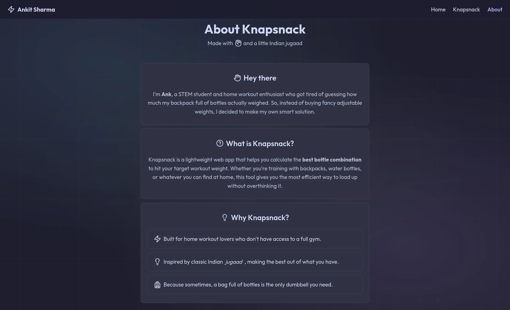

# Weight Knapsnack

A client-side web app that calculates the best bottle combination to hit your target workout weight. Perfect for home workout enthusiasts using weighted backpacks.

<p align="center">
    
</p>

## Features

- Flexible input (kg, g, lb) with smart conversions
- Persistent bottle data via localStorage
- Dynamic bottle table editor (add, edit, remove)
- Overshoot and penalty controls
- Clean tabular output up to 3 decimals
- **Runs entirely in-browser**, no server required
- Lightweight UI built with vanilla HTML/CSS/JS... No bulky frameworks!
- **Offline Android app**, packaged with lean Tauri

## Algorithm

Uses **dynamic programming** to find the optimal bottle combination:

1. **Score-based ranking**: Each combination is scored based on weight difference from target and number of bottles used
2. **Penalty system**: More bottles = higher penalty (configurable), encouraging minimal bottle usage
3. **Overshoot control**: Can allow slight overshoot with configurable ratio threshold
4. **Two-pass evaluation**: Finds best solution under target and best over target, then picks based on your overshoot settings

The DP table tracks `(score, bottle_count)` for each achievable weight, ensuring you get the mathematically optimal combo every time.

## Usage and Downloads

The web app is available at [ankitsm08.github.io/weight-knapsnack/](https://ankitsm08.github.io/weight-knapsnack/).

Downloadable `apk` file is available in the **Releases** page.

## Local Development

This project uses `just` as a command runner for development and compilation.

### Prerequisites

- Node.js & `pnpm`
- Rust and `cargo-tauri` CLI installed (`cargo install tauri-cli`)
- Android Studio (to manage Android SDKs, Tools and NDKs)

Run the `just` command from the root directory:

```bash
just --list
```

This will list all available tasks, including `dev` and `build`.

### Running the Web Version

Otherwise, you may simply open `./web/index.html` in your browser. Or serve it locally using:

```bash
pnpx serve ./web/
```

## Tech Stack

- Vanilla HTML, CSS, JavaScript
- No dependencies, no frameworks
- LocalStorage for persistence
- Tauri for packaging apk for Android
- Legacy Flask backend in `/python` (deprecated)

## License

MIT License
